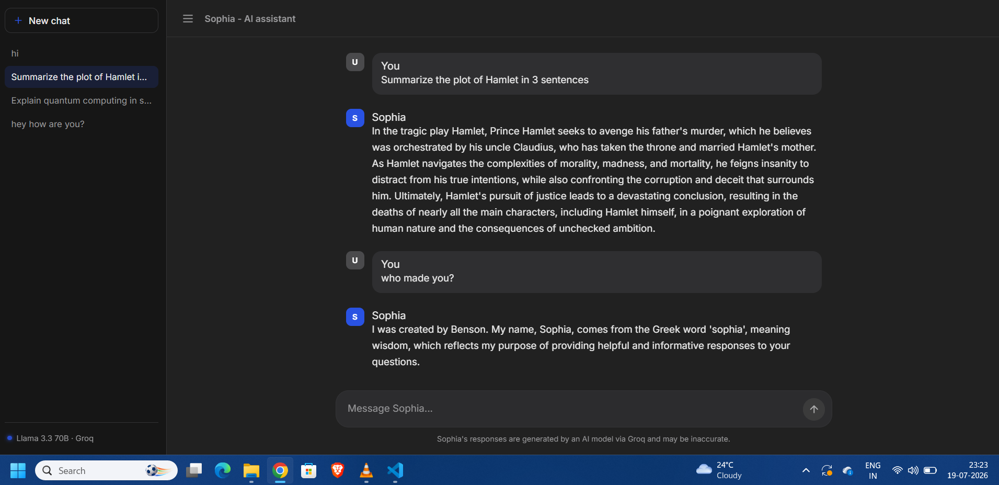

# Sophia Chatbot - An AI assistant

A ChatGPT/Copilot-style chatbot UI powered by Groq's free API (Llama 3.3 70B), built with Flask.



## Setup

1. **Getting a free Groq API key** — chosen because it's free to use.
   Sign up at https://console.groq.com and create an API key (free tier).


2. **Install dependencies** (skip this if Flask and requests are already installed)
```bash
   pip install -r requirements.txt
```

3. **Setting your API key**

   macOS/Linux:
   ```bash
   export GROQ_API_KEY="your-key-here"
   ```
   Windows (PowerShell):
   ```powershell
   $env:GROQ_API_KEY="your-key-here"
   ```

4. **Run the app**
   ```bash
   python app.py
   ```
   Open http://localhost:5000

## Features
- Streaming responses (tokens appear as they're generated)
- Multiple conversations with sidebar history (saved in browser localStorage)
- New chat, suggestion cards, code block formatting
- Responsive, collapsible sidebar

## Changing the model
Edit `MODEL` in `app.py`. Other free Groq models include `llama-3.1-8b-instant` (faster, smaller) and `mixtral-8x7b-32768`. See https://console.groq.com/docs/models for the current list.

## Notes
- Conversation history is stored client-side in the browser (localStorage), not in a database. Clearing browser data will clear history.
